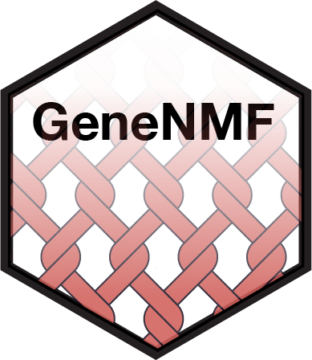

# GeneNMF: unsupervised discovery of gene programs in single-cell data

[](https://cran.r-project.org/package=GeneNMF)
[](https://cran.r-project.org/package=GeneNMF)


<p align="center">
  
</p>

Non-negative matrix factorization is a method for the analysis of high dimensional data that allows extracting sparse and meaningful features from a set of non-negative data vectors. It is well suited for decomposing scRNA-seq data, effectively reducing large complex matrices ($10^4$ of genes times $10^5$ of cells) into a few interpretable gene programs. It has been especially used to extract recurrent gene programs in cancer cells (see e.g. [Barkely et al. (2022)](https://www.nature.com/articles/s41588-022-01141-9) and [Gavish et al. (2023)](https://www.nature.com/articles/s41586-023-06130-4)), which are otherwise difficult to integrate and analyse jointly.

**GeneNMF** is a package that implements methods for matrix factorization and gene program discovery for single-cell omics data. It can be applied directly on Seurat objects to reduce the dimensionality of the data and to detect robust gene programs across multiple samples. For fast NMF calculation, GeneNMF relies on [RcppML](https://github.com/zdebruine/RcppML) (see [DeBruine et al. 2024](https://www.biorxiv.org/content/10.1101/2021.09.01.458620v2.full)).

## Installation
Install release version from [CRAN](https://CRAN.R-project.org/package=GeneNMF):
```{r}
install.packages("GeneNMF")
```
Or for the latest version, install from GitHub:
```{r}
library(remotes)
remotes::install_github("carmonalab/GeneNMF")
```

## Test your installation
```{r}
library(GeneNMF)
data(sampleObj)
sampleObj <- runNMF(sampleObj, k=5)
```

## Meta programs discovery using default parameters

Perform NMF over a list of Seurat objects and for multiple values of k (number of NMF factors) to extract gene programs
```{r}
sampleObj.list <- Seurat::SplitObject(sampleObj, split.by = "donor")
geneNMF.programs <- multiNMF(sampleObj.list, k=4:9)
```
Cluster gene programs from multiple samples and k's into meta-programs (MPs), i.e. consensus programs that are robustly identified across NMF runs. Compute MP metrics and most influencial MP genes.
```{r}
geneNMF.metaprograms <- getMetaPrograms(geneNMF.programs, nMP=5)
```

## GeneNMF demos
Find demos of the functionalities of GeneNMF and more explanations in the following tutorials:

* [Decomposing human PBMC data](https://carmonalab.github.io/GeneNMF.demo/NMF_demo_PBMC.html)
* [Gene programs in cancer cells](https://carmonalab.github.io/GeneNMF.demo/NMF_demo_cancercells.html)

For the source code, see the [GeneNMF.demo repository](https://github.com/carmonalab/GeneNMF.demo).

## News: version 0.6 is here

We made some improvements to the algorithm to allow more robust identification of metaprograms, and easier tuning of parameters. Here are the main changes:
* We updated how meta-programs (MPs) are calculated from individual programs. Instead of extracting gene sets for each program and then calculating a consensus, we keep the full vector of gene weights and calculate cosine similarities between the vectors. Consensus gene weights are then calculated as the average over all programs in a MP. 
* To impose sparsity in the decomposition, we include a `specificity.weight` parameter, which is used to re-normalize NMF loadings based on how specific a gene is for a given program. 
* To determine the number of genes to be included in a MP, we calculate the cumulative distribution for the gene weights in a given MP. Only genes that cumulatively explain up to a fraction of the total weight (`weight.explained` parameter) are included in the MP gene set.
* The definition and default of `min.confidence` has changed. The confidence of a gene in a given MP is calculated as the fraction of programs in which the gene has been determined to be part of the invidual program (using `weight.explained=0.8`).
* The parameter `nprograms` in the function `getMetaPrograms()` has been renamed to `nMP`, to avoid confusion
* New defaults: expression matrices are now by default not scaled or centered (the behavior can be altered using the `scale` and `center` parameters)

## Citation

If you used GeneNMF in your work, please cite:

**Wounding triggers invasive progression in human basal cell carcinoma**. Laura Yerly, Massimo Andreatta, Josep Garnica, Jeremy Di Domizio, Michel Gilliet, Santiago J Carmona, Francois Kuonen. [bioRxiv 2024 10.1101/2024.05.31.596823](https://doi.org/10.1101/2024.05.31.596823)

